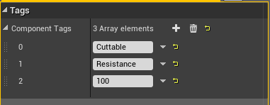
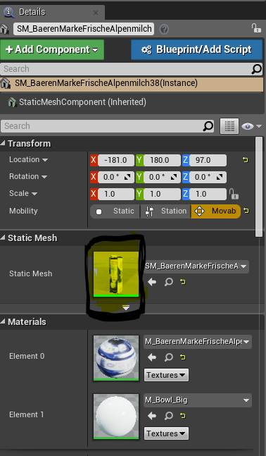
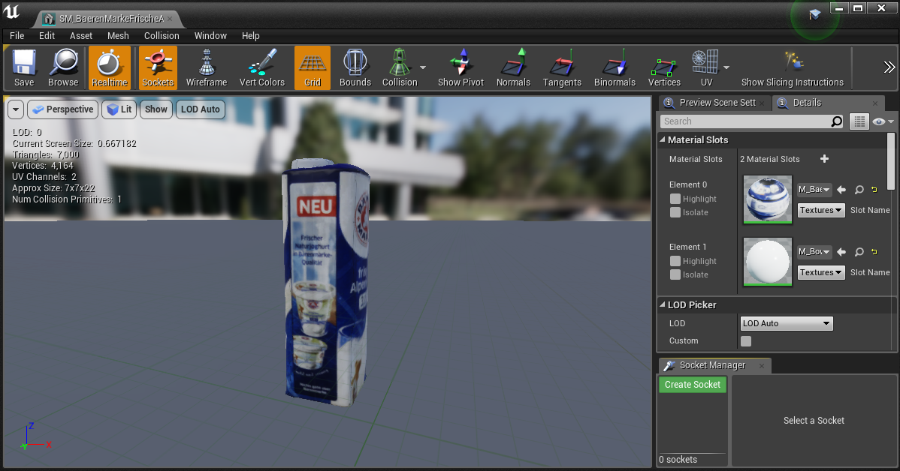

# UR17 - P2

| Nr | Tutorials |
|----:|--------|
|1| [Creating a Knife](#creating-a-new-knife) |
|2| [Make an Object Cuttable](#make-object-cuttable) |
|3| [Give an Object an Inner Material](#give-the-object-an-inner-material)|

## Creating a new Knife

### Step 1: Creating Sockets in the StaticMeshEditor

For this first choose a StaticMesh on which you want the SlicingLogic to be.
In this example we use the **SM_Knife_Table**. Double click on it in the
**Content Browser** to open the StaticMeshEditor for it.

In the top bottom should be a tab called **Socket Manager**. Press the button
and add three sockets named **BladeBox**, **Handle** and **CuttingExitpointBox**.
It should look like this:

  
**The Socket Manager**

From there on you can begin to place the tokens as needed in the StaticMeshEditor, e.g.

  
**Example Socket Placement**

With that done you can save the StaticMesh in the StaticMeshEditor and leave it.
All the StaticMeshComponents with that StaticMesh now all have these Sockets.

### Step 2: Spawn the boxes in the Editor

Now that the knife has the boxes, we can begin to spawn them inside the editor.
First we select the StaticMeshComponent in the Editor.

Then on the top, in the same row as **Play** and **Launch**, there's the button
called "**Slicing Options**", clicking on it reveals more options such as Debug
Checkboxes. The important Button is "**Replace Sockets on Selected Object**".

  

After clicking it, it spawns the BoxComponents. If they don't appear at first
simply click on something else and click on the knife again. It just needs
to refresh.

***The Knife is done. Result:***

  
**Example Box Placements**  
[Top](#ur---p2)

## Make Object Cuttable

### Step 1: Select StaticMeshComponent

To make an object cuttable select one in the Viewport.

  
**It will look like this**

### Step 2: Enable Overlap Boolean & Tag

Just as in ***Step 2: Tag a StaticMeshComponent to a Knife*** we now add a
tag called "**Cuttable**" into the Tag section. Refer to the mentioned Step
above on how to do that.

The other thing to do is activating that our Selected Mesh is able to generate
Ovelaps on it's own. For that simply go to the Collision section of your Selected
StaticMeshComponent click on ***Generate Overlap Event***.

  

***Now that object is Cuttable.***

### (Optional) Step 3: Add Resistance
To give an object a resistance on which the knife's progress through it is hindered, go to the tag section (under the Details view) and add two more tags: The first one called "**Resistance**" and the second a number from one to one-hundred.  

***You don't need this, as it will work even without these Tags.***  

  
**It will look like this**  
[Top](#ur---p2)

## Give the Object an Inner Material

### Step 1: Go into the Static Mesh Editor
To do so go to any Static Mesh, or your object, and select it with a left mouse click. After look to the Details view on the right and double click upon the Static Mesh.

    

After that you will find yourself, or at least a window opened, inside the Static Mesh Editor.

  
**It will looks remotely like this**

### Step 2: Add a new Material Slot

To create another slot, press the `+` Key. That will create another slot under your current one which you must rename to `InsideCutMaterial`. If you've done so you're able to select another Material in the appearing dropdown menu to use for the new planes created by the Knife.

  
**If done correctly, it should look like this.**  
[Top](#ur---p2)
